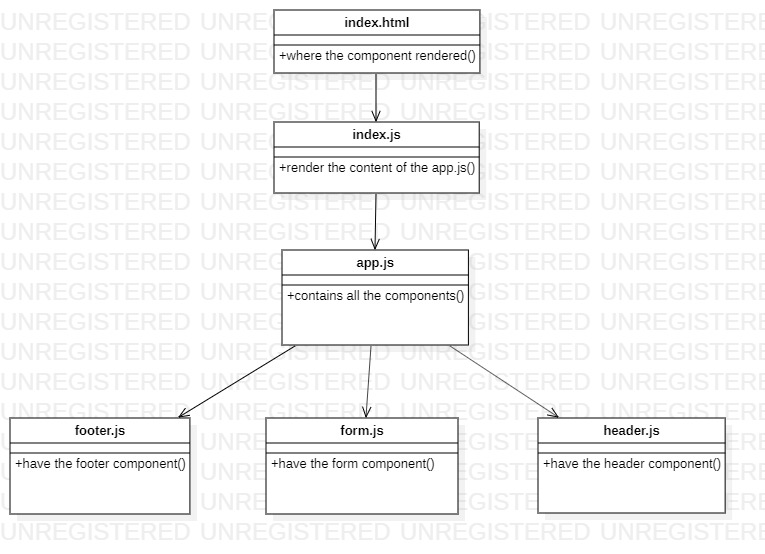

# resty


[Lab 26](https://github.com/laith-401-advanced-javascript/resty/pull/1)
[Lab 27](https://github.com/laith-401-advanced-javascript/resty/pull/2)


## About this repostory
```
---
Today, we begin the first of a 4-Phase build of the RESTy application, written in React. In this first phase, our goal is to setup the basic scaffolding of the application, with intent being to add more functionality to the system as we go. This initial build sets up the file structure so that we can progressively build this application in a scalable manner
---
```

## Features
```
---
Number and name of feature: Notes
Estimate of time needed to complete: 2 hours 
Start time: 16:00
Finish time: 21:0
Actual time needed to complete: 3 hours
---
```


## Date published

```
---
date: 2020-9-7 10:00
---
```

## author

```
authorName : Laith Al Daree

```

## location
```
---
location: Az Zarqa-Al Azraq-Jordan
---
```

## Contact 

```
---
Email:mr.laith_2011@hotmail.com
GitHub:https://github.com/laith-2020
linkedIn :https://www.linkedin.com/in/laith-aldaree/
---
```


* if you have any quastion feel free to send me an 
  email : mr.laith_2011@hotmail.com


## UML

Link to an image of the UML for your application and response to events

